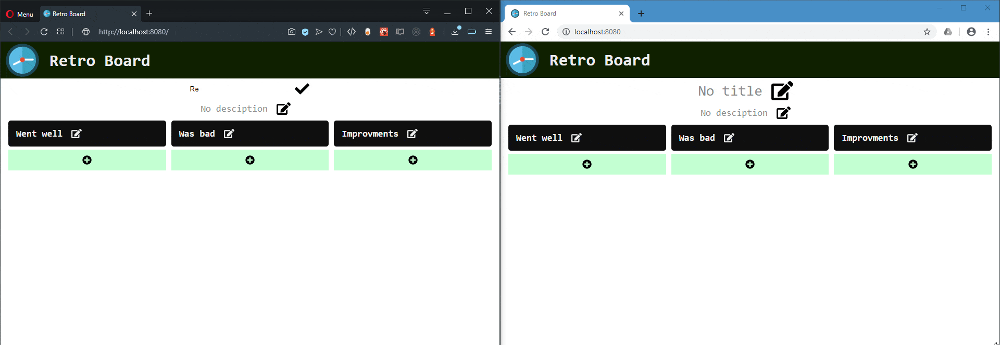

# retro-board

## Client

### Used libs

- React
- [socket.io-client](https://socket.io/docs/client-api/)
- [styled-components](https://styled-components.com/)

### How to run

In main folder:

```
npm install
npm start
```

## Client

### Used libs

- [express](https://expressjs.com/)
- [socket.io](https://socket.io/)
- [sqlite3](https://styled-components.com/)

### How to run

In `server` folder:

```
npm install
node app.js
```

## Demo


